# backend-TODO

Web Services & RESTFul API for ToDoList with Express.

## Deploy Link

https://gentle-jacket-newt.cyclic.app/

### Auth Endpoints

* Register

    method: POST 
    https://gentle-jacket-newt.cyclic.app/auth/regis

    Used to register an account, for example:
    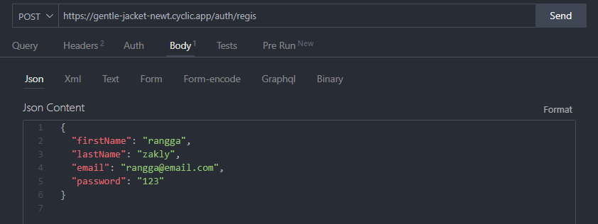

    Server response:
    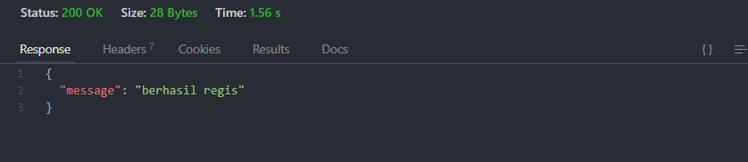

* Login

    method: POST
    https://gentle-jacket-newt.cyclic.app/auth/login

    Used to login your account, for the example:
    

    Server response:  
    

### User Endpoints

* Get All Users

    method: GET
    https://gentle-jacket-newt.cyclic.app/users

    Used for checking available users, for the example:
    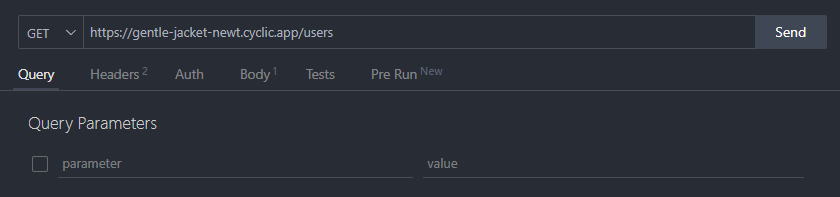

    Server response:
    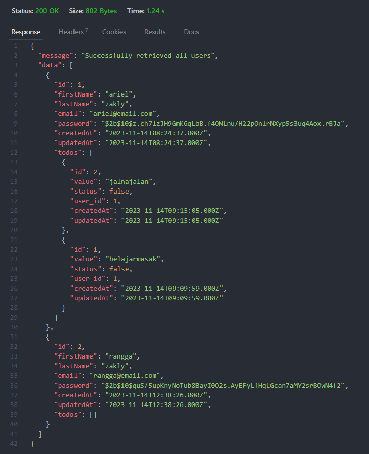

* Get User By ID

    method: GET
    https://gentle-jacket-newt.cyclic.app/users/id

    Used to get user data by ID, for the example:
    

    Server response:  
    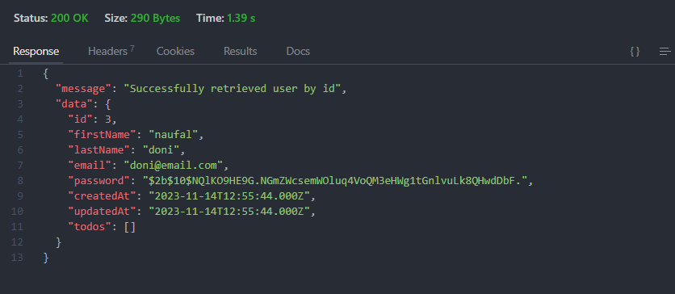

* Delete User By ID

    method: DELETE
    https://gentle-jacket-newt.cyclic.app/users/id

    Used to delete user data by ID, for the example:
    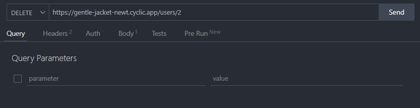

    Server response:  
    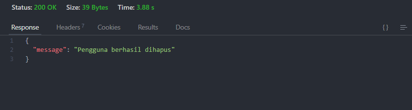

* Update User By ID

    method: PUT
    https://gentle-jacket-newt.cyclic.app/users/id

    Used to update user data by ID, for the example:
    

    Server response:  
    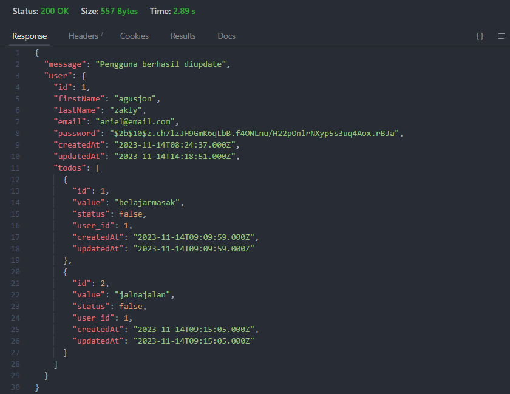

### Todo Endpoints

* Get All Todos

    method: GET
    https://gentle-jacket-newt.cyclic.app/todos

    Used for get all todos, for the example:
    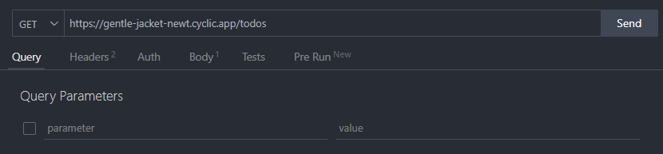

    Server response:
    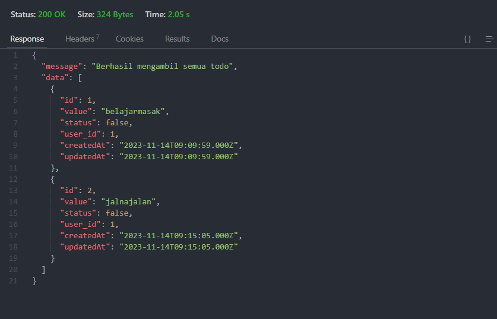

* Get Todo By ID

    method: GET
    https://gentle-jacket-newt.cyclic.app/todos/id

    Used to get todo data by ID, for the example:
    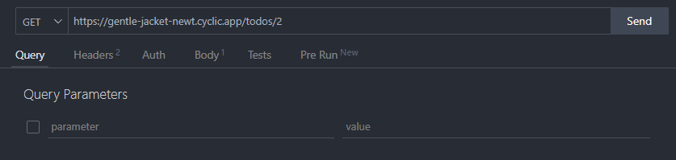

    Server response:  
    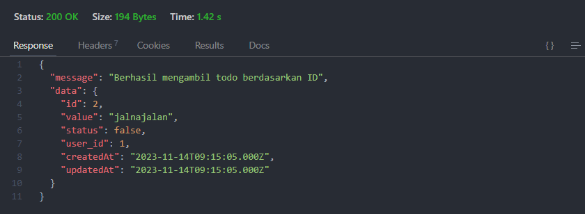

* Add Todo

    method: POST
    https://gentle-jacket-newt.cyclic.app/todos

    Used to add new todo, for the example:
    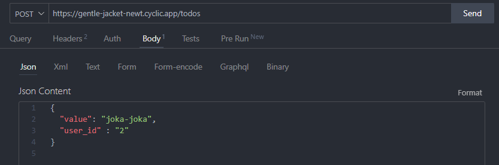

    Server response:  
    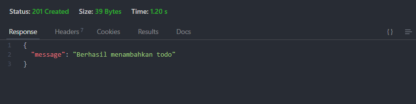

* Delete Todo By ID

    method: DELETE
    https://gentle-jacket-newt.cyclic.app/todos/id

    Used to delete todo data by ID, for the example:
    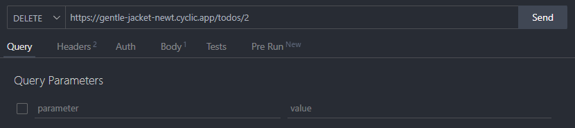

    Server response:  
    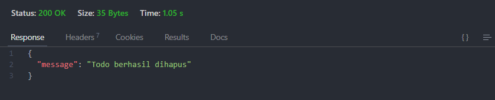

    If we check todos:
    

    Todo with id = 2 deleted

* Delete All Todo

    method: DELETE
     https://gentle-jacket-newt.cyclic.app/todos

    Used to delete all todo, for the example:
    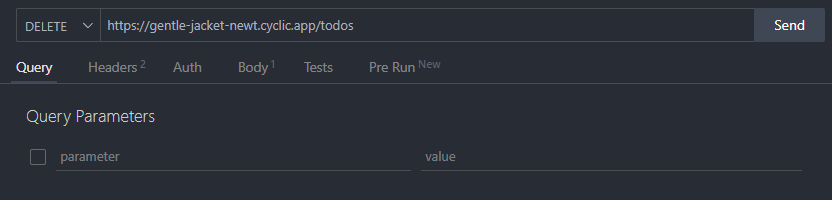

    Server response:  
    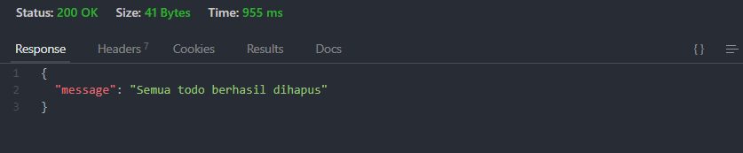

* Update Todo By ID

    method: PUT
    https://gentle-jacket-newt.cyclic.app/todos/id

    Used to update todo data by ID, for the example:
    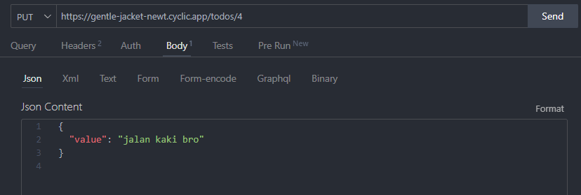

    Server response:  
    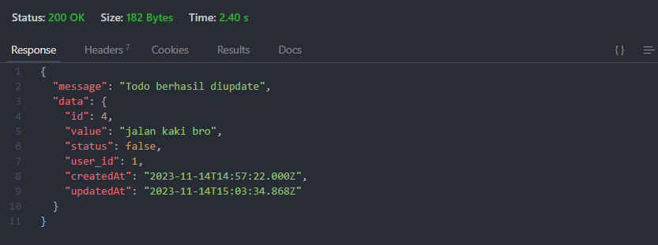