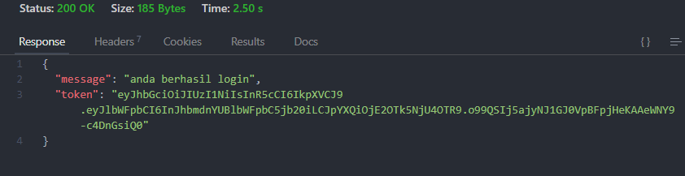

# backend-TODO

Web Services & RESTFul API for ToDoList with Express.

## Deploy Link

https://gentle-jacket-newt.cyclic.app/

### Auth Endpoints

* Register

    method: POST 
    https://gentle-jacket-newt.cyclic.app/auth/regis

    Used to register an account, for example:
    

    Server response:
    

* Login

    method: POST
    https://gentle-jacket-newt.cyclic.app/auth/login

    Used to login your account, for the example:
    

    Server response:  
    

### User Endpoints

* Get All Users

    method: GET
    https://gentle-jacket-newt.cyclic.app/users

    Used for checking available users, for the example:
    

    Server response:
    

